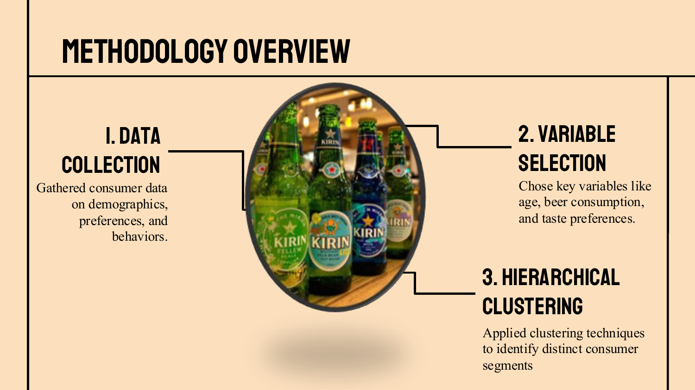
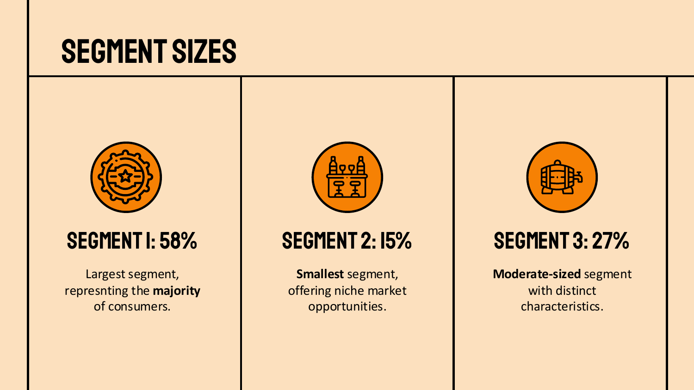
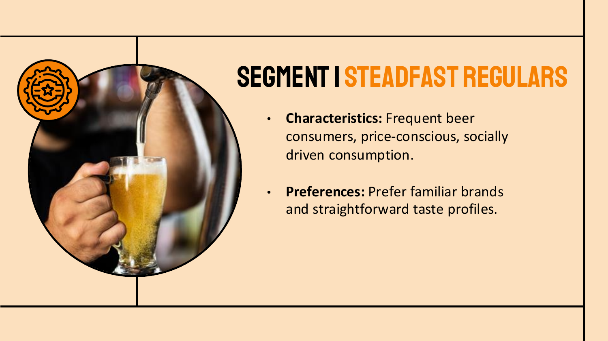
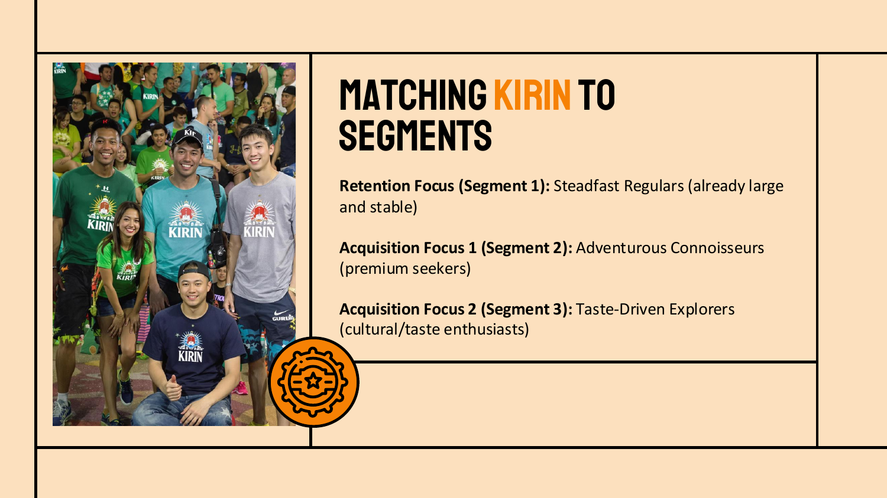
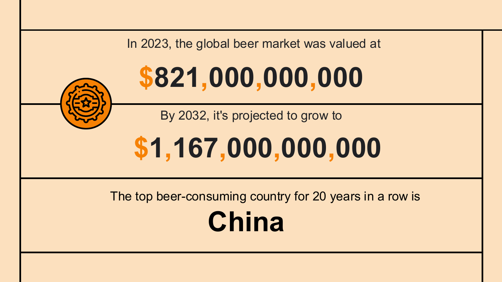
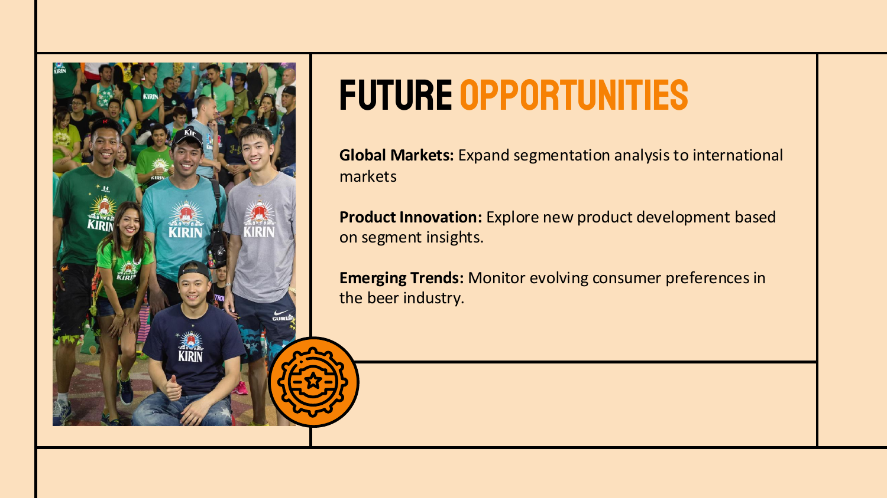

# 🍺 Kirin Beer Market Segmentation Analysis

## 📌 Overview
This project analyzes customer data for **Kirin Beer** to identify distinct market segments using clustering and consumer profiling techniques.  
The goal: uncover insights for **data-driven, targeted marketing**.

---

## 🎯 Objectives
- Understand key consumer personas for Kirin Beer  
- Apply unsupervised learning to segment the market  
- Translate data-driven clusters into marketing strategy  

---

## 🛠️ Tools & Technologies
- **Python** (Pandas, NumPy, Seaborn, Scikit-learn)  
- **Jupyter Notebook**  
- **K-Means Clustering**, Elbow Method, Silhouette Score  
- **Tableau / Matplotlib** for visuals  

---

## 🧪 Methodology

### 1. Data Collection
Collected consumer data on demographics, preferences, and purchase behavior.

### 2. Feature Engineering
Derived key features like average spend, frequency, and product preferences.

### 3. Clustering & Evaluation
Used **K-Means** clustering and validated with **Silhouette Score**.

### 4. Persona Development
Formed 3 personas:  
- `Steadfast Regulars`  
- `Adventurous Connoisseurs`  
- `Taste-Driven Explorers`  

---

## 🖼️ Visual Insights

### 🔹 Methodology Snapshot

### 🔹 Segment Sizes

### 🔹 Persona Highlights

### 🔹 Strategic Alignment

### 🔹 Summary of Insights

### 🔹 Market Opportunity

---

## 💡 Business Insights
- 👦 Young urban customers favored premium lagers  
- 👴 Older rural consumers reacted better to price promotions  
- 📦 Suggestions included: regional bundles, cultural event marketing, influencer outreach  

---

## 🔄 Next Steps
- Add time-series patterns for seasonal targeting  
- Extend segmentation to product lines and international markets  

---

## 👨‍💻 Author
**Manan Upadhyay**  
📫 [Connect on LinkedIn](https://www.linkedin.com/in/mananupadhyay2000/)

---

## 📂 Project Files
- `Hold_my_beer.pdf`: Slide deck with complete strategy 🍻
